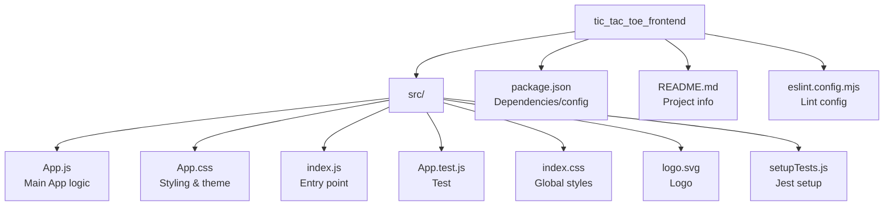

# Tic Tac Toe Frontend – Codebase Overview

## Structure and Framework

This codebase is the frontend for a browser-based Tic Tac Toe game, built using the React framework. It is designed with simplicity and modern minimalism, focusing on user experience and maintainability. The project uses vanilla CSS for styles without relying on heavy external UI libraries.

- **Base Directory:** `browsertictactoe-96261-66a67340/tic_tac_toe_frontend`
- **Framework:** React 18 (with react-scripts)
- **Styling:** Vanilla CSS, CSS Variables for theme/colors (`src/App.css`)
- **Testing:** Jest + React Testing Library
- **Linting:** ESLint with React plugin and custom config

## Main Components and Files

```
tic_tac_toe_frontend/
├── README.md         # Project overview and instructions
├── package.json      # React app configuration, dependencies, scripts
├── eslint.config.mjs # ESLint config with React & JS rules
├── post_process_status.lock # System/automation status file
└── src/
    ├── App.js        # Main React component (Tic Tac Toe app + game logic)
    ├── App.css       # Main stylesheet, custom component & theme styles
    ├── App.test.js   # Basic test skeleton for the App
    ├── index.js      # React DOM bootstrap/entrypoint
    ├── index.css     # Global baseline styles
    ├── logo.svg      # Default React logo asset
    └── setupTests.js # Jest-DOM setup for React Testing Library
```

### Component Highlights

- **App.js**  
  The central component handling:
    - Game state (board, turn, win/draw).
    - Rendering the game board, status (turn/winner/draw), and reset button.
    - Contains all game logic, including winner determination and board updates.
  - Composed of:
    - `<App/>` – root, manages global state and UI.
    - `<GameBoard/>` – renders 3x3 board grid, delegates cell clicks.
    - `<Square/>` – single cell/button component.
  - Uses functional React components with hooks (`useState`, `useEffect`).

- **App.css**  
  - Thematic customizations via CSS variables (light and dark themes).
  - Styles for game elements: board, squares, buttons, status.
  - Responsive/mobile-friendly design with modern minimal visuals.

- **App.test.js / setupTests.js**  
  - Contains a placeholder/sample test for React testing setup.

- **eslint.config.mjs**  
  - Linting configuration enables recommended JS and React rules, disables requirement for React to be in JSX scope for React 17+.

- **package.json**  
  - Lists minimal dependencies: `react`, `react-dom`, `react-scripts`, and dev dependency `cross-env`.
  - Scripts: `start`, `build`, `test`, `eject`.

## Key Features

- **Interactive 3x3 Grid:**  
  Players alternate turns placing "X" or "O" on a 3x3 board. Clicks are managed with state to prevent invalid moves.

- **Real-Time Win/Draw Detection:**  
  Game logic checks for all possible winning lines or for a draw after every move, updates the UI immediately.

- **Player Turn Indication:**  
  The current player's turn is prominently displayed above the board during gameplay.

- **Reset/Replay Functionality:**  
  A button allows users to reset/replay the game at any time.

- **Modern UI / Minimal Dependencies:**  
  The interface is visually appealing and quick to load, with no UI frameworks.

- **Customizable Theming:**  
  Colors and basic variables (primary, secondary, accent) are easily editable in CSS; supports dark/light theme (via CSS, not toggled in UI).

- **Responsiveness:**  
  Layout and controls adjust for mobile or smaller screens.

## Notable Design Decisions

- **No heavy UI frameworks:** Only vanilla CSS is used for styling.
- **Self-contained game logic:** All game mechanisms (win check, turn control, draw detection, board state) are in the main component file.
- **Ease of modification:** Minimal structure and small number of files enable easy extension or customization.

## Example: How the Game Logic Works

- On each cell click, the `handleCellClick` function updates the board if the move is valid and alternates the turn.
- The effect hook (`useEffect`) automatically checks for a win or draw after every move and sets winner state.
- When the game ends, winning cells are highlighted, and the status message updates with the winner or draw.

## Getting Started

- Install dependencies: `npm install`
- Start development server: `npm start`
- Run tests: `npm test`

## Summary

This frontend codebase delivers a simple but robust platform for playing Tic Tac Toe in the browser. Its design emphasizes comprehension, maintainability, and modern aesthetics, making it easy for developers to understand and extend.

## Mermaid Diagram: Project Structure



---

**Sources Consulted:**  
- `src/App.js`, `src/App.css`, `README.md`, `package.json`, `eslint.config.mjs`, `src/index.js`, file/folder structure.

